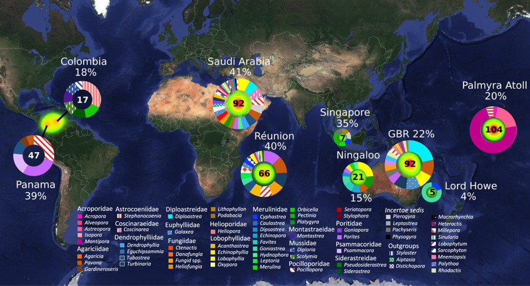
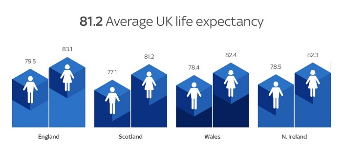

```{r setup, include=FALSE}
knitr::opts_chunk$set(echo = TRUE)
```

Your reading reflection document should be about 1-2 pages.  I have provided a few potential questions you can use to frame your reflections but you are not required to answer all (or even any) of these questions.  Your reflections should do more than just summarize the readings.  The primary goal is to reflect on how what you learned in the readings will impact you as a researcher.  (Delete this paragraph and any of the following questions that you don't tackle before turning in your reflections.)

### Potential questions to answer

1. Summarize two or three key points.
1. What ideas from the readings do you think you will utilize most in your project?
1. Are there parts of the readings where you disagree with the authors?  If so, how and why?
1. What parts of the readings are unclear?  What is confusing about these parts?
1. For the topic discussed, are there important ideas that are missing from the author's argument?

## General Thoughts

*: 





### Notes from Readings

*: The process of making a really good or really useful graph cannot be boiled down to a list of simple rules to be followed without exception in all circumstances. The graphs you make are meant to be looked at by someone. The effectiveness of any particular graph is not just a matter of how it looks in the abstract, but also a question of who is looking at it, and why

*: Just like seemingly sober and authoritative tables of numbers, data visualizations have their own rhetoric of plausibility. Anscombe’s quartet notwithstanding, and especially for large volumes of data, summary statistics and model estimates should be thought of as tools that we use to deliberately simplify things in a way that lets us see past a cloud of data points shown in a figure

*: For convenience, we can say that our problems tend to come in three varieties. Some are strictly aesthetic. The graph we are looking at is in some way tacky, tasteless, or a hodgepodge of ugly or inconsistent design choices. Some are substantive. Here, our graph has problems that are due to the data being presented. Good taste might make things look better, but what we really need is to make better use of the data we have, or get new information and plot that instead. And some problems are perceptual. In these cases, even with good aesthetic qualities and good data, the graph will be confusing or misleading because of how people perceive and process what they are looking at.

*: At the same time, Tufte’s early academic work in political science shows that he effectively applied his own ideas to research questions. His Political Control of the Economy (1978) combines tables, figures, and text in a manner that remains remarkably fresh almost forty years later.

*: Generative art note

*: How many questions can a visual answer? To what extent is that limited by the number of variables? 

*: Borkin et al. (2013) also found that visually unique, “Infographic” style graphs were more memorable than more standard statistical visualizations. (“It appears that novel and unexpected visualizations can be better remembered than the visualizations with limited variability that we are exposed to since elementary school”, they remark.)

*: It is even possible that, in a world where people are on guard against junky infographics, the “halo effect” accompanying a well-produced figure might make it easier to mislead some audiences.

***Vision Science***


*: It seems that search performance on the shape channel degrades much faster than on the color channel.(Note scaling effects as well, i.e. larger of smaller shapes while varying other shapes such as circles and triangles)

*: Related to the above: Similar kinds of effects can be demonstrated for search across other channels (for instance, with size, angle, elongation, and movement) and for particular kinds of searches within channels. 


*: Use of area in representing 3-dimensional plots. Geometry is a factor, as circular area and rectangular area are perceived differently, though dependent upon other facets of analysis such as variables of interest and variable type (continuous, discrete, categorical)

*:  The data values were encoded or mapped in to the graph, and now we have to get them back out again. When doing this, we do best judging the relative position of elements aligned on a common scale, as for example when we compare the heights of bars on a bar chart, or the position of dots with reference to a fixed x or y axis. 


*: If we have ordered data and we want the viewer to efficiently make comparisons, then we should try to encode it as a position on a common scale. Encoding numbers as lengths (absent a scale) works too, but not as effectively. Encoding them as areas will make comparisons less accurate again, and so on.


*: The principle of proportional ink: The sizes of shaded areas in a visualization need to be proportional to the data values they represent.