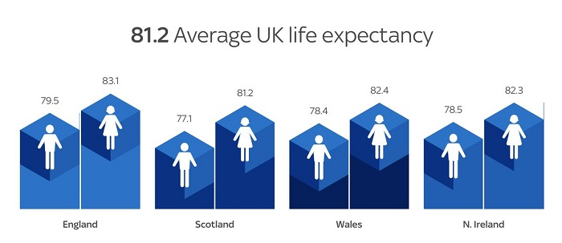

```{r setup, include=FALSE}
knitr::opts_chunk$set(echo = TRUE)
```

## Reflection
My intent in this reflection is to detail what makes the below data visualization 'bad', to comment on the process of finding the below visual, and to synthesize my self-reflection on the process of critiquing the 'bad' data visual---noting the difficulty in finding the below visual from its cited source, Sky News.  



The visual above was found from a KDNuggets article, *'The Best and Worst Data Visualizations of 2018'*. The visual originates from a 2018 Sky News article titled *'Life expectancy increase in UK stalls for first time since 1982, ONS study finds'*. Both articles are linked below.

There are a number of issues one can note of the above visual. To delineate my own thoughts with those of the contributors to the KDnuggets article, the KDnuggets article notes: 

  *On first glance, this chart from Sky News doesn’t look particularly bad. But what struck me was the height of the bars – they didn’t seem to be proportionate to the data they’re showing. When I inspected the page, sure enough the height of the bar showing 77.1, was set to a height of 61%. This doesn’t make sense and misleads the audience into thinking the difference is a lot larger than it is.*


  *I fixed this by changing the height to what it should be and the below shows the actual representation. This visualization is perhaps not as interesting or striking as the original, but it is a lot more accurate.*

### Personal Thoughts
I agree with these thoughts. To expand on their argument (and to add additional aspects to the critique): Sky News appears to have committed the 'cardinal sin' of not starting a linear plot with base 0. Additionally:

* The visual is a jarring mix 2 & 3 dimensions, which causes confusion when a reader attempts to decide on a 'top' to the chart---an issue of depth.

* For those who perceive the chart in 3 dimensions, an interpretation by area or volume is inappropriate (and length may be considered a more appropriate alternative). 

* Naturally, a reader would wonder when the data was collected. As Britain recently saw a decline in life expectancy, being able to compare the values over time would meaningfully improve the visual. 

* Likewise, there are two dimensions included in the above visual---sex and location. I am unfortunately not familiar with English terrane and find myself unable to (easily) analyze differences across gender and location simultaneously. 

* On the topic of sex: Though the use of gendered icons is clever, their color and use does not lend itself to easy digestion---though this may be confounded through the inclusion of geographical region. 

The above critiques, taken together, lend itself to the conclusion the visual that can be improved. 

### An personally interesting meander---The Search for Plot
What I found most intriguing from my investigation of this visual was the inability to replicate, or find the source of, the cited bar plot (outside of KDNuggets). To be explicit: In reading the Sky News article critiqued in the KDNuggets article, the critiqued visual does not appear. Nor is the chart hiding within the page source. I can only speculate on the sequence of events to have led to this event. Bearing that in mind, the *content* of the Sky New article does not appear to include the data referenced in the visual. Furthermore, the critiques listed above, particularly the lack of context regarding time, are detailed. 

This is all to say ***context is key***. To connect it directly with the recent readings: Taken in a vacuum, data visualizations can easily be critiqued, or at the very least motivate questions that require additional information. To accomplish this task, that of getting additional information, it is appropriate (and necessary) to incorporate tables, figures, and text to conduct and disseminate research. Data visualization is a component of both processes. Also, a checklist is not a silver bullet. 

### Referenced Articles
(1): Worst Data Visualizations of 2018 (2019): https://www.kdnuggets.com/2019/02/best-worst-data-visualization-2018.html

(2): Sky News Article Linked in 'KDNuggets Commentary' (2018): https://news.sky.com/story/life-expectancy-increase-in-uk-stalls-for-first-time-since-1982-ons-study-finds-11508237